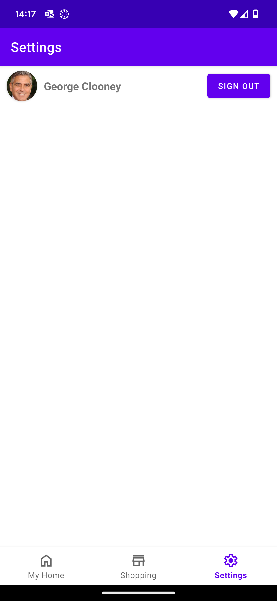

# SSH App User Interface
---
## UI Mock-up
> *This section formally documents the following GitHub issue: https://github.com/SEPP-SSH/Shared-Groceries/issues/19*

The following UI mock-up was created based on the features and description from the selected EDR.

  Browse View              |  Basket View              |  Empty Basket View
:-------------------------:|:-------------------------:|:-------------------------:
  |    |  

## Features
- Browse groceries from multiple categories in a tab layout.
- Offers tab for displaying items currently on discount.
- Basket screen displaying all the items in the basket, including their prices, quantity and which user added it.
- The basket screen will also display the total price for the order at the bottom of screen, as well as a total price for items the current user has added.
- Dropdown allowing the user to specify which supermarket they are browsing/viewing the basket for.
- When an item has been added to the basket, the user will then be able to increase/decrease the quantity of that item. The quantity will also be displayed for each item, as you can see in the layout design above.
- A checkout button will appear at the bottom of the basket view when there is at least one item in the basket. The checkout button will submit the order to the server but won't do anything further for this prototype.

 

## Omitted Features
- Although there is a searchbar present in the app UI, search functionality has been omitted from this prototype for simplification.
- The Home Fragment will also not be populated, as this just shows how the new shopping functionaliy would fit-in with the exising smart home functionality.
- The Settings Fragment (ehich can be seen above) will also remain largely unpopulated for the same reason, only displaying the user currently logged-in (which will be hardcoded for this prototype) for clarity about which user added which item to the basket.
- The sign-out button in the settings fragment will also not be functional for this prototype.

## Dependencies
We are using the Glide library for loading images from URLs into imageviews as it is fast and not resource heavy. It also caches images meaning that images don't have to be fetched multiple times.