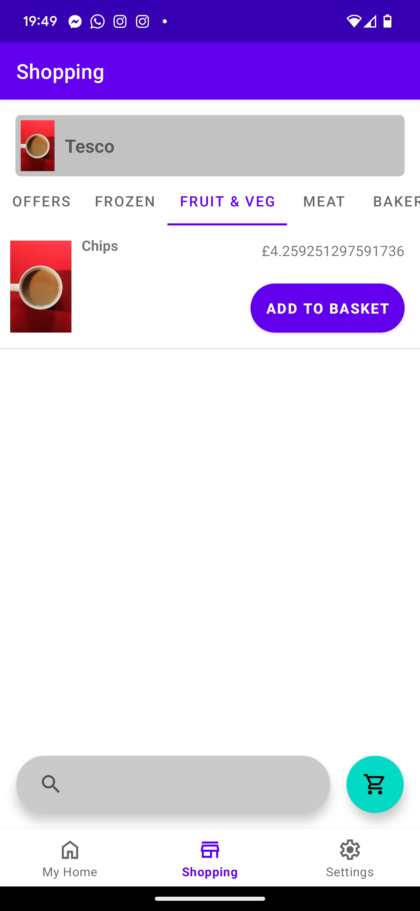
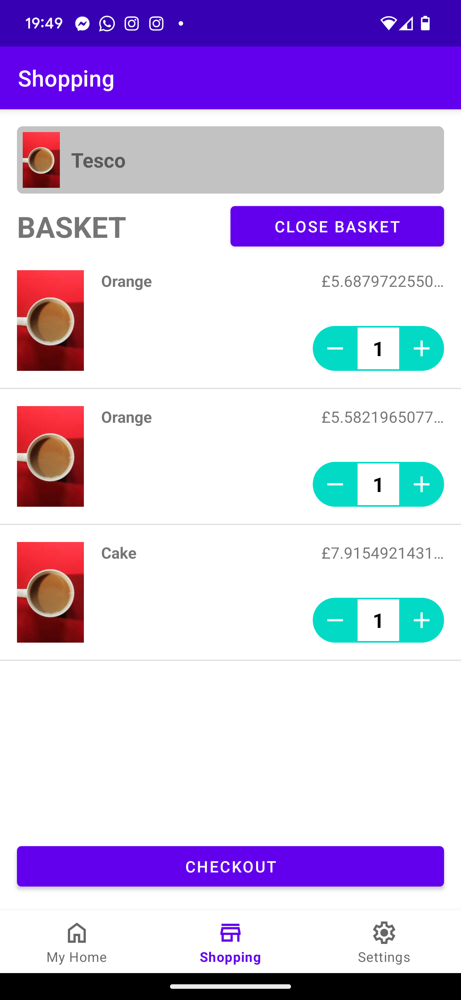
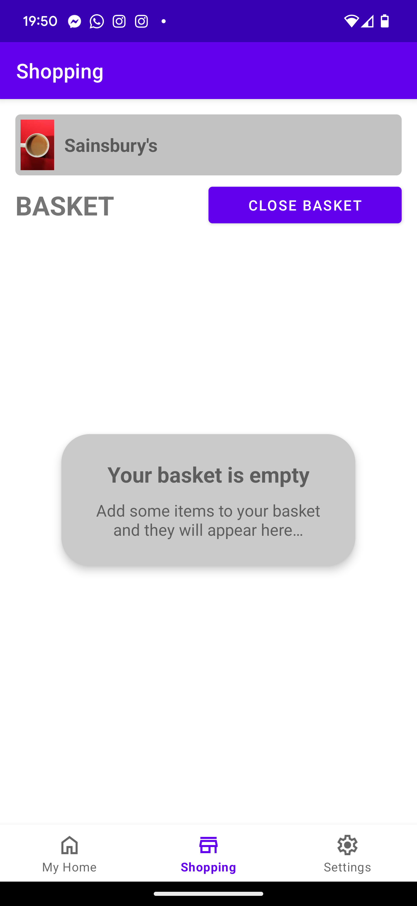

# SSH App User Interface
---
## UI Mock-up
> *This section formally documents the following GitHub issue: https://github.com/SEPP-SSH/Shared-Groceries/issues/19*

The following UI mock-up was created based on the features and description from the selected EDR.

  Browse View              |  Basket View              |  Empty Basket View
:-------------------------:|:-------------------------:|:-------------------------:
  |    |  

## Features
- Browse groceries from multiple categories in a tab layout.
- Offers tab for displaying speicial offers.
- Basket screen displaying all the items in the basket, including their prices, quantity and which user added it.
- Dropdown allowing the user to specify which supermarket they are browsing/viewing the basket for.

## Omitted Features
- Although there is a searchbar present in the app UI, search functionality has been omitted from this prototype for simplification.
