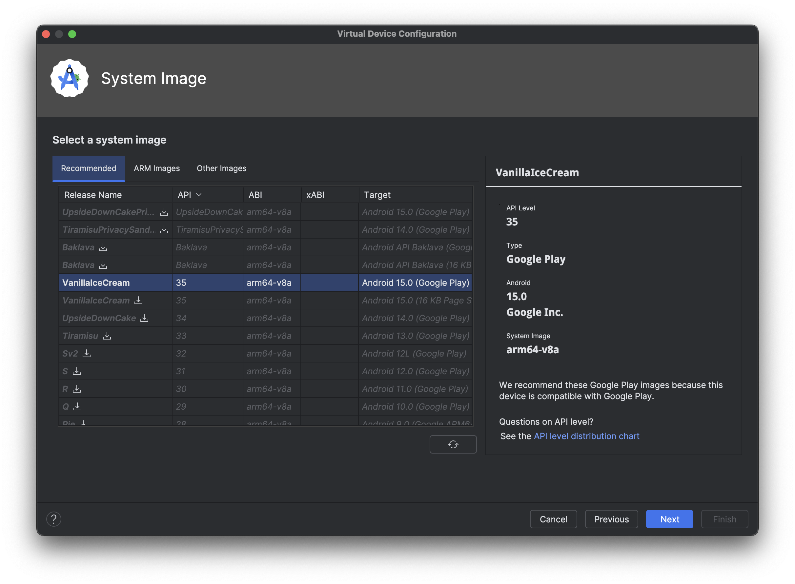

# How to run the SSH App
To see the group grocery shopping feature prototype in action:
1. Clone the repository onto your machine.

2. Install Android Studio _(the app was built with Android Studio Ladybug | 2024.2.1 Patch 2)_.

3. Load the project located at `./Android` (i.e. located in the root of the repository) in Android Studio.

4. Open the "Terminal" tab in Android studio (or, less conveniently, any terminal at the `Android` directory - wherever that may reside on your system).

5. Run the following command: `cd ../SSH-Cloud/production-orchestration && docker-compose build --no-cache` _(it will take a little while)._

6. Wait until the command has finished _(like so...)_

7. Run the following command: `docker-compose up`. Don't be alarmed - this will hang for a short period of time, whilst the SSH Cloud server program waits for the MySQL server to spin up before starting the program server.

8. Wait until you see the following "Javalin" ASCII art:

Note that this command won't terminate, as the server is running in a Docker container, and will continue to do so until the process is killed (`ctl-c`).

9. Now you can start the Android App running in the Android Emulator. The steps for reproducing the results shown are listed below, but _may not_ be necessary if you already have a suitable virtual device emulator on your machine, and a suitable run configuration added by Android Studio.

10. Add an emulator by clicking the "Device Manager" button in Android Studio _(see below)_.

11. Select "Medium Phone" for the results we show in our documentation.

12. Select the "VanillaIceCream" system image for the results we show in our documentation.

13. Click "Next" on the "Verify Configuration" screen _(see below)_, leaving values at their defaults.

14. After the wizard exits, and you're returned to the Android Studio editor, verify that the device has been added, as shown in `a.` below, and then add (if one hasn't already been detected) a run configuration by clicking the "Run/Debug Configurations" button, as shown in `b.` below.

15. Click an "Add new run configuration" button in the wizard.

16. Select "Android App" from the drop-down menu.

17. You'll see the default settings like so:

18. Select `SSH.app.main` from the "Module" drop-down menu _(see below)_, and then click "OK".

19. After the wizard exits, and you're returned to the Android Studio editor, click the run button for the new run configuration _(see below)_.

20. Once the emulator loads, the project should build and you should be landed at the "My Home" fragment - as shown below. To see the group grocery shopping feature, click into the "Shopping" fragment via the tab-bar at the bottom of the UI.

---
>To read how the feature works, and to explore some functionality, see the [What you can do]() document.
---

21. To close the running emulation, you can simply kill the emulation process in any way you wish. **However**, to close the SSH Cloud server _properly_, you need to follow these steps:
22. Focus back into the terminal window from earlier, and kill the process - most easily with `ctl-c`

23. Once the processes have "gracefully stopped", run the following command: `docker-compose down && cd ../../Android`
24. Once that has completed execution, you are _finally_ free to return going about your business!