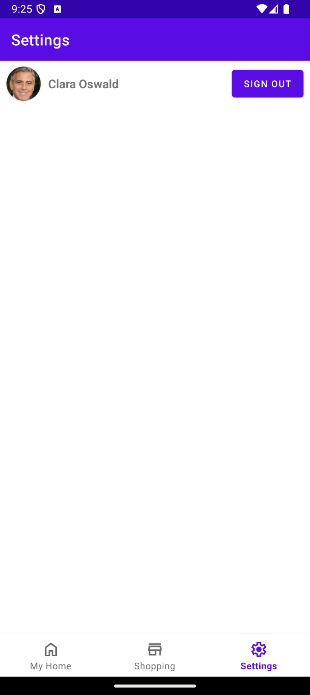

# See the Prototype "In Action"
---
In the following document, we show examples of some of the functionalities of the prototyped group grocery shopping order feature in the SSH App.

## When you load up the app
| "My Home" tab | "Shopping" tab | "Settings" tab |
| --------------- | ------------ | -------------- |
|  |  |  |

The "Shopping" tab is where you will find the prototyped group grocery shopping order feature.

## What's in the Shopping tab?
When you've tapped into the Shopping tab, you'll see...

The partner supermaket selection "drop-down" menu:
| A supermarket is selected | Choices appear! |
| ------------------------- | --------------- |
|  |  |

The categories tab bar:

| Example Category 1 | Example Category 2 | 
| ------------------ | ------------------ |
|  |  |

With these screenshots, you can also see that each category is populated with a list of items, where each item has:
  - an image, to visually describe to the user what item they're being shown for consideration.
  - a title, to clearly specify what exactly that item is.
  - a full-retail price.
  - (if applicable) an on-offer price (which would be less than the full-retail price).
  - an "add to basket" button.

You can also see a search bar and a basket/trolley button.
_(The search bar is disbaled for the purposes of this prototype)._

## How to add an item to the basket?
When clicking the "Add to basket" button, the app sends a request to SSH Cloud to record that you've added an item to the group basket.

Of course, the app also adds a visual confirmation for the user that the item has been added:

i.e. The "Add to basket" button has been replaced with a quantity and a switch that allows you to add more or request less (or none at all) of the given item:

| Added one | Added three more | Removed all four |
| --------- | ---------------- | ---------------- |
|  |  |  |

## What's going on in the basket???
When you click through to the basket, you'll see the following basket view:

This view implements the "items" tab described in the [selected Engineering Design Review (EDR)](/Documentation/Selected%20EDR.pdf), and is a list of items - much similar to the browsing and selection view we looked at previously, but has extra information.

Said extra information refers to:
- The "Added by" label, which shows the currently logged in user which housemate added the item.
- A quantity for how many of the item that the user has added to the basket, as well as a switch for the user to change this quantity (or remove the item from the basket completely).

You may notice from the above screenshot that the same item appears multiple times if different housemates have added some quantity of it to the group basket. Furthermore, you'll notice that the quantity switch is greyed out for these items.

The underlying logic behind this, as specified in the selected EDR, is that users only pay for the items they add, rather than an even split, meaning that the feature needs to support the case in which different housemates add the same item.

The selected EDR also outlines that due to only being obligated to pay for _their_ items, that users (i.e. housemates) shouldn't be able to modify the other items added in the order by other housemates, except by way of the basket approval mechanism - which has been placed out of scope for this prototype.

Thus, in summary, the user can only modify the quantities of items that _they_ added to the cart.

## I want my shopping!
Once the user has reviewed the full order total, as well as _their_ total - which is indicated with labels at the bottom of the basket view, the user can click the "Checkout" button to initiate the checkout process _- simulated for the purposes of this prototype._

| Ready to checkout | Checkout clicked |
| ----------------- | ---------------- |
|  |  |

---
---
